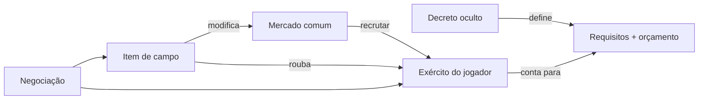

# Pivot de design v0.1 → v0.2

Documento de alinhamento com feedback do PO (Hugo Rezende, 22/07/2026).

**GDD atualizado:** [GDD-v0.2.md](GDD-v0.2.md)  
**GDD anterior (arquivado):** [GDD.md](GDD.md) — modelo semi-cooperativo com Cofre da Invasão

---

## O que o PO disse (resumo)

O **Makai** (reino dos demônios) está em guerra com os humanos. O Rei Demônio tem orçamento escasso e convoca seus generais com uma tarefa individual:

> Montar um exército com **atributos X** usando no máximo **orçamento Y**.

Vence o general que cumprir o decreto da forma **mais otimizada** ou dentro dos requisitos exigidos.

O jogo é um **carteado de trapaça**: manipulação de campo, mercado volátil, roubo, negociação estilo Munchkin.

---

## O que a IA interpretou errado (v0.1)

| PO quer | v0.1 fez |
|---------|----------|
| Cada general monta **seu exército** contra requisitos do decreto | Mesa coopera num **Cofre compartilhado** para invasão |
| Economia = **orçamento pessoal** + custo das raças | Três recursos abstratos (Ouro, Comida, Militar) |
| **Mercado de monstros** visível com stats (PV, ATK, INT) | Mercado de cartas de efeito genérico |
| Raças têm **atributos e traços** (voa, nada, bruto) | Raças davam "+Militar" ao pool |
| Cartas na mão = **itens** (roubar, sabotar mercado, revelar decreto) | Intriga/acusação/golpe político |
| Raças em campo = **exército do jogador** | Recursos iam para cofre da mesa |
| Mercado **volátil** (doença, cidade destruída, preço muda) | Eventos afetavam requisito da fase |
| Negociação e troca livre entre jogadores | Negociação sem sistema de troca de cartas/raças |
| Layout: monstro central, custo, stats no canto | Layout genérico texto |

---

## O que permanece válido da v0.1

- Generais do Rei Demônio com **objetivo secreto** (agora = Decreto, não mandato paralelo)
- **Negociação** e desconfiança na mesa
- **Traição** via cartas que revelam ou trocam decreto alheio
- **Rejogabilidade** por combinação de decretos + mercado + itens
- Tom de intriga na corte demoníaca
- Referências úteis: *Munchkin* (negociação), *Dead of Winter* (objetivo oculto), economia volátil

---

## Novo modelo em uma frase

> Cada jogador recruta monstros do mercado para montar um exército que cumpre o **Decreto secreto** do Rei, enquanto usa **itens** para manipular o mercado, sabotar rivais e negociar — tudo dentro do **orçamento** da missão.

---

## Três zonas de cartas (definição PO)

```
┌─────────────────────────────────────────────────────────┐
│  OCULTO          │  MÃO              │  CAMPO (público) │
│  Decreto do Rei  │  Cartas de Item   │  Raças / Exército│
│  (só o dono vê)  │  (manipulação)    │  + Mercado comum │
└─────────────────────────────────────────────────────────┘
```

| Zona | Visibilidade | Função |
|------|--------------|--------|
| **Decreto** | Oculto | Missão individual: requisitos de exército + orçamento máximo |
| **Mão** | Privada | Itens: roubar, buff, armadilha, campo, revelar/trocar decreto |
| **Campo** | Pública | Exército recrutado + mercado compartilhado de raças |

---

## Anatomia da carta de Raça (layout PO + referência visual)

Baseado no layout enviado pelo PO:

```
┌─────────────────────────────┐
│ PV 4  ATK 3  INT 2    [4◆] │  ← stats (sup. esq.) + custo (sup. dir.)
│ HARPIA          · Voador    │  ← nome + classe/traço
│                             │
│      [ arte do monstro ]    │  ← ilustração central
│                             │
│ Voa · Ignora terreno lento  │  ← característica da raça
│ Habilidade: ...             │  ← texto (se houver)
└─────────────────────────────┘
```

| Campo | Posição | Exemplo |
|-------|---------|---------|
| **PV** | Superior esquerdo | Vida que a raça contribui ao exército |
| **ATK** | Superior esquerdo | Força de combate |
| **INT** | Superior esquerdo | Inteligência / astúcia |
| **Custo** | Superior direito (círculo) | Soma ao orçamento gasto |
| **Nome + classe** | Barra superior | Harpia · Voador |
| **Arte** | Centro | Placeholder até arte final |
| **Traço** | Inferior | Voa, Nada, Bruto, Furtivo… |
| **Habilidade** | Inferior | Efeito único opcional |

---

## Decreto do Rei (exemplos alinhados ao PO)

| Decreto | Orçamento | Requisitos |
|---------|-----------|------------|
| Legião dos Céus | 18◆ | ≥3 raças com **Voa** · PV total ≥12 |
| Tritões do Abismo | 15◆ | ≥2 raças com **Nada** · ATK total ≥8 |
| Punho de Pedra | 20◆ | ≥2 raças **Bruto** · INT total ≤4 |
| Esquadra Mista | 16◆ | 4 raças diferentes · nenhuma com custo ≥6◆ |

---

## Itens (categorias PO)

| Categoria | Exemplo | Efeito |
|-----------|---------|--------|
| **Campo** | Cidade natal destruída | Raças Harpia −2 ATK e −1◆ de custo no mercado |
| **Campo** | Praga no pântano | Raças **Nada** ficam doentes: −2 PV |
| **Roubo** | Suborno de clã | Roube 1 raça do exército de um jogador |
| **Roubo** | Espionagem | Roube 1 carta da mão de um jogador |
| **Intriga** | Interrogatório real | Alvo revela o Decreto |
| **Intriga** | Realocar missão | Alvo troca Decreto por outro do baralho |
| **Buff** | Forja de guerra | +1 ATK em todas as suas raças Bruto |
| **Armadilha** | Contrato falso | Quem recrutar neste turno paga +2◆ |

---

## Mercado volátil (core loop PO)



**Exemplo na mesa:** Jogador A investiu em Harpias. Jogador B joga *Cidade Natal Destruída* → Harpias no mercado ficam mais baratas mas perdem ATK. A pode se beneficiar do preço ou estar ferrado nos requisitos de ATK.

---

## Próximos passos de design

1. [ ] Validar GDD v0.2 com PO
2. [ ] Reescrever RULEBOOK v0.2
3. [ ] Atualizar templates de impressão (carta de raça nova)
4. [ ] Protótipo mínimo: 12 raças, 8 decretos, 16 itens, mercado 6 slots
5. [ ] Playtest: mercado volátil é divertido ou frustrante demais?

---

*Este documento não apaga o trabalho da v0.1 — serve como ponte de alinhamento.*
