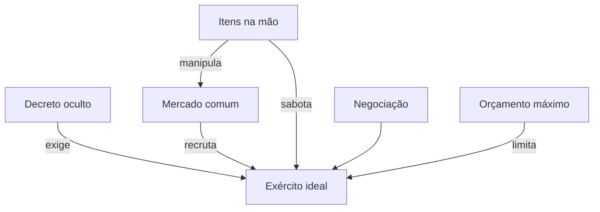

# GDD — DemonLord v0.2

Documento mestre de design alinhado ao feedback do PO (Hugo Rezende).

> **Substitui** o modelo v0.1 (semi-cooperativo / Cofre da Invasão).  
> Ver [DESIGN-PIVOT-v0.2.md](DESIGN-PIVOT-v0.2.md) para o que mudou.

---

## Índice

1. [Visão geral](#1-visão-geral)
2. [Pilares de design](#2-pilares-de-design)
3. [Componentes e zonas de jogo](#3-componentes-e-zonas-de-jogo)
4. [Anatomia das cartas](#4-anatomia-das-cartas)
5. [O mercado de raças](#5-o-mercado-de-raças)
6. [Decretos do Rei](#6-decretos-do-rei)
7. [Cartas de item](#7-cartas-de-item)
8. [Estrutura de turno e rodada](#8-estrutura-de-turno-e-rodada)
9. [Negociação e trapaça](#9-negociação-e-trapaça)
10. [Vitória e fim de jogo](#10-vitória-e-fim-de-jogo)
11. [Tabuleiro e layout de mesa](#11-tabuleiro-e-layout-de-mesa)
12. [Conteúdo MVP — catálogo inicial](#12-conteúdo-mvp--catálogo-inicial)
13. [Referências](#13-referências)
14. [Riscos e perguntas em aberto](#14-riscos-e-perguntas-em-aberto)
15. [Roadmap de produção](#15-roadmap-de-produção)

---

## 1. Visão geral

### Elevator pitch

O **Makai** está em guerra com o Reino Humano. O Rei Demônio tem pouco ouro e convoca seus generais: cada um recebe um **Decreto secreto** — monte um exército com atributos específicos dentro do **orçamento** concedido. No mercado de monstros, raças têm **PV, ATK e Inteligência**; cartas de **item** manipulam preços, roubam tropas e expõem rivais. Negocie como em *Munchkin*, saboteie como um general sem escrúpulos, e vença montando o exército mais otimizado.

### Gênero

| Aspecto | Definição |
|---------|-----------|
| **Tipo** | Board game de cartas, competitivo com negociação |
| **Mecânicas** | Montagem de exército, mercado volátil, objetivos ocultos, roubo, troca |
| **Tom** | Makai dark-fantasy, trapaça e intriga de corte |
| **Jogadores** | 3–5 (sweet spot: 4) |
| **Duração** | 45–75 min (meta) |
| **Idade** | 14+ |

### Fantasia do jogador

Você é um general demônio com missão secreta e orçamento apertado. Recruta harpias, golems e ogros do mercado comum — mas qualquer rival pode destruir a cidade natal das harpias, roubar seu ogro ou forçar você a revelar seu decreto.

### O que este jogo **é**

- Carteado de **montar exército** sob restrições
- **Mercado volátil** que todos manipulam
- **Negociação** livre (acordos não são obrigatórios)
- **Objetivo oculto** por jogador (Decreto do Rei)

### O que **não** é

- Cooperativo (não há pool compartilhado de vitória)
- Deck-builder puro
- Combate tático com grid (stats são contabilizados, não movidos no mapa no MVP)

---

## 2. Pilares de design

| Pilar | Na mesa |
|-------|---------|
| **Orçamento como puzzle** | Cada ◆ conta; raça cara vs raça fraca é escolha real |
| **Mercado volátil** | Item muda preço e stat de raça — oportunidade ou sabotagem |
| **Informação oculta** | Decreto escondido até alguém forçar revelação |
| **Interação direta** | Roubar raça, roubar carta, trocar com jogador |
| **Legibilidade** | Carta de raça mostra tudo: PV, ATK, INT, custo, traço |

### Tensão central



---

## 3. Componentes e zonas de jogo

### Componentes MVP

| Componente | Qtd | Notas |
|------------|-----|-------|
| Cartas de **Raça** | 36–48 | Mercado + baralho de reposição |
| Cartas de **Item** | 40 | Mão dos jogadores |
| Cartas de **Decreto** | 24 | 1 por jogador, ocultas |
| Tabuleiro / playmat | 1 | Mercado 6 slots + referência |
| Marcadores de orçamento | 5 | Trilha 0–25◆ por jogador |
| Marcador de rodada | 1 | — |

### Zonas por jogador

| Zona | Visível | Conteúdo |
|------|---------|----------|
| **Decreto** | Só o dono | Missão do Rei: requisitos + orçamento |
| **Mão** | Privada | Itens (compra, roubo, campo…) |
| **Exército** | Pública | Raças recrutadas (cartas em campo) |
| **Orçamento gasto** | Público | Total de ◆ já comprometido |

### Zonas compartilhadas

| Zona | Função |
|------|--------|
| **Mercado** | 6 raças visíveis para recrutar (layout referência PO) |
| **Descarte** | Itens usados, raças removidas |
| **Baralho de raças** | Repõe mercado |
| **Baralho de itens** | Compra ou compra inicial por rodada |

---

## 4. Anatomia das cartas

### 4.1 Carta de Raça (mercado e exército)

Layout alinhado à referência visual do PO:

```
┌─────────────────────────────┐
│ PV 4   ATK 3   INT 2    (4)│  stats + custo em ◆
│─────────────────────────────│
│ HARPIA            Voador    │
│                             │
│         [ ARTE ]            │
│                             │
│ Traço: Voa                  │
│ Marcha pelos céus do Makai  │
└─────────────────────────────┘
```

| Campo | Uso mecânico |
|-------|--------------|
| **PV** | Soma ao total de vida do exército |
| **ATK** | Soma ao total de força |
| **INT** | Soma ao total de inteligência |
| **Custo (◆)** | Soma ao orçamento gasto ao recrutar |
| **Traço** | Tag para requisitos do Decreto (Voa, Nada, Bruto, Furtivo, Arcano…) |
| **Habilidade** | Efeito opcional da raça |

**Regra de orçamento:** ao recrutar, o custo **não sai de um pool de ouro físico** — soma ao total gasto do general, que não pode exceder o limite do Decreto.

### 4.2 Carta de Decreto (oculta)

| Campo | Exemplo |
|-------|---------|
| Orçamento máximo | 18◆ |
| Requisitos de stat | PV total ≥14, ATK ≥10 |
| Requisitos de traço | ≥3 raças com **Voa** |
| Requisitos de composição | ≥4 raças diferentes |
| Bônus de otimização | "Gaste ≤15◆ para vitória perfeita" |

### 4.3 Carta de Item (mão)

Tipos (podem compartilhar baralho com ícone):

| Tipo | Ícone | Exemplo |
|------|-------|---------|
| Campo | 🏴 | Efeito persistente no mercado |
| Equipamento | ⚙ | Buff em raça sua |
| Armadilha | ⚡ | Dispara quando rival recruta |
| Intriga | 🎭 | Revela ou troca decreto |
| Roubo | 🗡 | Rouba raça ou carta |

---

## 5. O mercado de raças

### Setup

1. Revele **6 raças** no mercado (grid 2×3 ou 3×2 — ver layout PO).
2. Baralho de raças embaralhado ao lado.

### Recrutar (ação principal)

1. Escolha 1 raça do mercado.
2. Pague o **custo em ◆** (soma ao seu total gasto; deve ser ≤ orçamento do Decreto).
3. Coloque a raça no seu **exército** (campo público).
4. Repõe o slot vazio do mercado.

### Volatilidade

Cartas de **Campo** e alguns **Itens** alteram:

| Modificador | Exemplo |
|-------------|---------|
| Custo ±N◆ | Praga: Harpias −1◆ |
| PV ±N | Frio: Brutos −2 PV |
| ATK ±N | Cidade destruída: Harpias −2 ATK |
| INT ±N | Biblioteca queimada: Arcanos −3 INT |
| Indisponível | Raça X não pode ser recrutada nesta rodada |

Modificadores são **públicos** e empilham. Quando uma carta de campo sai de jogo, o modificador termina.

### Exemplo PO

> Jogador X investiu em Harpias. Jogador Y joga *Cidade Natal Destruída* → Harpias −2 ATK e −1◆ no mercado. X pode comprar barato mas falhar no requisito de ATK do decreto.

---

## 6. Decretos do Rei

Distribuídos no setup — **1 por jogador**, ocultos.

### Categorias de requisito

| Tipo | Exemplo |
|------|---------|
| **Stat mínimo** | ATK total ≥12 |
| **Stat máximo** | INT total ≤6 (exército bruto) |
| **Traço** | ≥2 **Nada**, ≥3 **Voa** |
| **Composição** | 5 raças, máx. 2 do mesmo traço |
| **Orçamento** | Gastar no máximo 16◆ |
| **Otimização** | Cumprir tudo gastando ≤80% do orçamento |

### Interação com decretos alheios

| Item | Efeito |
|------|--------|
| Interrogatório real | Alvo revela Decreto |
| Realocar missão | Alvo descarta Decreto e compra outro |
| Espionagem | Olhe o Decreto; não revela para a mesa |

### Vitória por decreto

Jogador **declara** cumprimento no seu turno se acredita ter atingido todos os requisitos. Mesa valida. Se correto → vitória. Se incorreto → penalidade (perde 1 turno ou descarta 2 itens — a definir em playtest).

---

## 7. Cartas de item

### Compra e mão

- Início de rodada: comprar **1 item** OU comprar **0** e comprar **2** no próximo (opcional — playtest).
- Limite de mão: **5** (descarte no fim se exceder).

### Catálogo MVP (16 cartas)

**Campo (4)**  
- Cidade Natal Destruída (Harpia −2 ATK, −1◆)  
- Praga no Pântano (Nada −2 PV)  
- Forja Abissal aberta (Bruto +1 ATK, +1◆)  
- Mercado negro (todas raças +1◆)

**Roubo (4)**  
- Suborno de clã (roube 1 raça do exército alvo)  
- Espionagem (roube 1 carta da mão)  
- Saque (roube 2◆ de orçamento — reduz gasto do alvo? ou limite efetivo — playtest)  
- Deserção (devolva 1 raça sua ao mercado)

**Intriga (4)**  
- Interrogatório real (revela decreto)  
- Realocar missão (troca decreto)  
- Contrato falso (alvo paga +2◆ no próximo recrutamento)  
- Propaganda (copie o traço de 1 raça sua para contar em dobro nesta rodada)

**Buff / Armadilha (4)**  
- Forja portátil (+2 ATK em 1 raça Bruta sua)  
- Armadilha: laço (cancela recrutamento de 1 rival)  
- Treinamento real (+1 INT em todas suas raças)  
- Escudo de pedra (+3 PV em 1 raça)

---

## 8. Estrutura de turno e rodada

### Setup partida

1. Cada jogador recebe 1 **Decreto** (oculto).
2. Comprar **3 itens** iniciais.
3. Revelar **6 raças** no mercado.
4. Orçamento gasto = **0** para todos.

### Turno do general

| # | Ação | Detalhe |
|---|------|---------|
| 1 | **Comprar item** (opcional) | 1 do baralho |
| 2 | **Até 2 ações** da lista abaixo | Qualquer combinação |

**Lista de ações (escolhe 2):**

- **Recrutar** — mercado → exército (paga ◆)
- **Jogar item** — resolve e descarta (ou campo permanece)
- **Negociar** — troca com jogador (não vinculante até confirmar)
- **Declarar vitória** — valida decreto
- **Reposição mercado** (1× por turno) — descarta 1 slot e repõe (custa 1◆ do orçamento? playtest)

### Fim de rodada

Quando todos jogaram: limpar modificadores "até fim da rodada", passar marcador.

### Limite de orçamento

```
Orçamento gasto = soma dos custos de todas as raças no exército
                 + custos de itens que consumam ◆ (se houver)
Orçamento gasto ≤ Orçamento máximo do Decreto
```

---

## 9. Negociação e trapaça

### Negociação (estilo Munchkin)

- Jogadores podem trocar: itens, raças do exército, "favores" futuros.
- **Nada é obrigatório** — mentir e quebrar acordo é permitido.
- Trocas simultâneas: revelar o que entregam ao mesmo tempo.

### Roubo

- Itens de roubo resolvem contra exército ou mão.
- Raça roubada vai para o exército do ladrão (se couber no orçamento? **pergunta aberta** — ver §14).

### Trapaça de mercado

- Empilhar campos que favorecem suas raças e prejudicam as do rival.
- Timing: jogar campo quando rival está a 1 raça de completar decreto.

---

## 10. Vitória e fim de jogo

### Condições de vitória

| Modo | Regra |
|------|-------|
| **Padrão** | Primeiro a declarar e validar o Decreto vence |
| **Desempate otimização** | Se 2+ cumpriram na mesma rodada: menor ◆ gasto vence |
| **Fim por baralho** | Se mercado esgotar 2×: maior cumprimento parcial vence |

### Validação

1. Jogador revela Decreto.
2. Conta PV, ATK, INT, traços, nº de raças no exército.
3. Verifica orçamento.
4. Aplica modificadores temporários se ainda ativos.

---

## 11. Tabuleiro e layout de mesa

Baseado na referência visual enviada pelo PO:

```
┌──────────────────────────────────────────────────────────┐
│  [Jogador 2 exército]              [Jogador 3 exército]  │
│                                                          │
│     ┌─────┬─────┬─────┐                                  │
│     │ R1  │ R2  │ R3  │  ← MERCADO (6 slots)            │
│     ├─────┼─────┼─────┤                                  │
│     │ R4  │ R5  │ R6  │                                  │
│     └─────┴─────┴─────┘                                  │
│                                                          │
│  [Jogador 1 exército]              [Jogador 4 exército]  │
│                                                          │
│  Trilha orçamento · Rodada · Efeitos de campo ativos     │
└──────────────────────────────────────────────────────────┘
```

### Playmat MVP

- **Centro:** grid mercado 2×3 (encaixe visual das cartas)
- **Bordas:** área de exército por jogador
- **Canto:** referência de turno + zona de efeitos de campo ativos
- **Formato impressão:** A3 (ver `docs/print/tabuleiro.html` — atualizar na v0.2)

---

## 12. Conteúdo MVP — catálogo inicial

### Raças (12 para playtest)

| Raça | PV | ATK | INT | ◆ | Traço | Habilidade |
|------|----|----|-----|---|-------|------------|
| Harpia | 3 | 4 | 2 | 4 | Voa | — |
| Golem | 6 | 5 | 1 | 5 | Bruto | +1 PV se INT total ≤5 |
| Goblin | 2 | 2 | 3 | 2 | Furtivo | — |
| Ogro | 5 | 6 | 1 | 5 | Bruto | — |
| Súcubo | 3 | 3 | 5 | 4 | Arcano | Rouba 1 item ao recrutar |
| Tritão | 4 | 3 | 2 | 3 | Nada | — |
| Kobold | 2 | 1 | 4 | 2 | Furtivo | +1 INT |
| Minotauro | 5 | 5 | 2 | 5 | Bruto | — |
| Espectro | 2 | 2 | 4 | 3 | Voa | Ignora campo terrestre |
| Slime | 4 | 2 | 1 | 2 | Nada | — |
| Diabrete | 2 | 3 | 3 | 3 | Arcano | — |
| Centauro | 4 | 4 | 2 | 4 | — | Marcha: +1 ATK |

### Decretos (8 para playtest)

| ID | Nome | Orçamento | Requisito resumido |
|----|------|-----------|-------------------|
| D01 | Legião dos Céus | 18◆ | ≥3 Voa, PV≥10 |
| D02 | Tritões do Abismo | 15◆ | ≥2 Nada, ATK≥8 |
| D03 | Punho de Pedra | 20◆ | ≥2 Bruto, INT≤5 |
| D04 | Esquadra Mista | 16◆ | 4 raças diferentes |
| D05 | Exército barato | 12◆ | 5 raças, custo médio ≤3◆ |
| D06 | Corte arcana | 18◆ | INT total ≥15 |
| D07 | Força bruta | 17◆ | ATK total ≥18 |
| D08 | Eficiência real | 14◆ | Cumprir gastando ≤11◆ |

---

## 13. Referências

| Jogo / mídia | O que absorvemos |
|--------------|------------------|
| **Munchkin** | Negociação, trapaça, combinações absurdas |
| **Makai** (folclore JP) | Nome e tom do reino demoníaco |
| Layout PO (imagem ref.) | Mercado central, stats na carta |
| v0.1 DemonLord | Decretos ocultos, tom de corte (mecânica substituída) |

---

## 14. Riscos e perguntas em aberto

| # | Pergunta | Impacto |
|---|----------|---------|
| 1 | Raça roubada conta no orçamento do ladrão? | Balanceamento de roubo |
| 2 | Orçamento é teto rígido ou pode exceder com penalidade? | Rigidez do puzzle |
| 3 | Mercado 6 fixo ou escala com jogadores? | Componentes |
| 4 | Declarar vitória errado: qual penalidade justa? | Anti-spam |
| 5 | Partida pode estagnar se todos sabotam? | Duração |
| 6 | Campo empilhado demais confunde? | UX |

---

## 15. Roadmap de produção

| Fase | Entrega |
|------|---------|
| **Agora** | Validar GDD v0.2 com PO |
| **+1** | RULEBOOK v0.2 |
| **+2** | Print: carta de raça novo layout + 12 exemplos |
| **+3** | Playtest papel com 4 jogadores |
| **+4** | Site: banner "v0.2 em design" + pivot doc público |

---

*GDD v0.2 — alinhado ao feedback do PO Hugo Rezende, 22/07/2026.*
