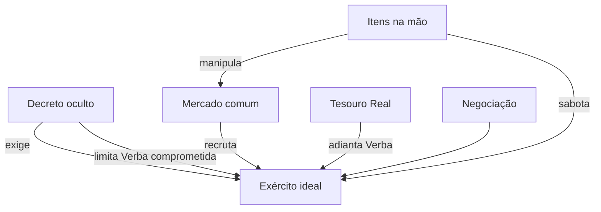

# GDD — DemonLord v0.2

Documento mestre de design alinhado ao feedback do PO (Hugo Rezende).

> **Substitui** o modelo v0.1 (semi-cooperativo / Cofre da Invasão).  
> Ver [DESIGN-PIVOT-v0.2.md](DESIGN-PIVOT-v0.2.md) para o que mudou.

---

## Índice

1. [Visão geral](#1-visão-geral)
2. [Pilares de design](#2-pilares-de-design)
3. [Componentes e zonas de jogo](#3-componentes-e-zonas-de-jogo)
4. [Anatomia das cartas](#4-anatomia-das-cartas)
5. [O mercado de raças](#5-o-mercado-de-raças)
6. [Decretos do Rei](#6-decretos-do-rei)
7. [Cartas de item](#7-cartas-de-item)
8. [Estrutura de turno e rodada](#8-estrutura-de-turno-e-rodada)
9. [Negociação e trapaça](#9-negociação-e-trapaça)
10. [Vitória e fim de jogo](#10-vitória-e-fim-de-jogo)
11. [Tabuleiro e layout de mesa](#11-tabuleiro-e-layout-de-mesa)
12. [Conteúdo MVP — catálogo inicial](#12-conteúdo-mvp--catálogo-inicial)
13. [Referências](#13-referências)
14. [Riscos e perguntas em aberto](#14-riscos-e-perguntas-em-aberto)
15. [Roadmap de produção](#15-roadmap-de-produção)

---

## 1. Visão geral

### Elevator pitch

O **Makai** está em guerra com o Reino Humano. O Rei Demônio tem pouco ouro e convoca seus generais: cada um recebe um **Decreto secreto** — monte um exército com atributos específicos dentro do **orçamento** concedido. O Tesouro Real adianta moedas para firmar contratos com os monstros, mas o Rei só aprova a operação se o exército cumprir o Decreto sem estourar a verba. Jogue cartas para transformar o terreno, manipular o mercado, sabotar exércitos e expor os planos dos rivais. Negocie como em *Munchkin*, trapaceie como um general sem escrúpulos e vença com o exército mais eficiente.

### Gênero

| Aspecto | Definição |
|---------|-----------|
| **Tipo** | Board game de cartas, competitivo com negociação |
| **Mecânicas** | Montagem de exército, mercado volátil, objetivos ocultos, roubo, troca |
| **Tom** | Makai dark-fantasy, trapaça e intriga de corte |
| **Jogadores** | 3–5 (sweet spot: 4) |
| **Duração** | 45–75 min (meta) |
| **Idade** | 14+ |

### Fantasia do jogador

Você é um general demônio com missão secreta e orçamento apertado. Recruta harpias, golems e ogros do mercado comum — mas qualquer rival pode destruir a cidade natal das harpias, roubar seu ogro ou forçar você a revelar seu decreto.

### O que este jogo **é**

- Carteado de **montar exército** sob restrições
- **Mercado volátil** que todos manipulam
- **Negociação** livre (acordos não são obrigatórios)
- **Objetivo oculto** por jogador (Decreto do Rei)

### O que **não** é

- Cooperativo (não há pool compartilhado de vitória)
- Deck-builder puro
- Combate tático com grid (stats são contabilizados, não movidos no mapa no MVP)

---

## 2. Pilares de design

| Pilar | Na mesa |
|-------|---------|
| **Crédito de Guerra** | Cada ◆ é Verba Real comprometida; contratos fortes pressionam o orçamento secreto |
| **Mundo manipulável** | Cartas alteram terreno, mercado, custos e exércitos — oportunidade ou sabotagem |
| **Informação oculta** | Decreto escondido até alguém forçar revelação |
| **Interação direta** | Roubar raça, roubar carta, trocar com jogador |
| **Legibilidade** | Carta de raça mostra tudo: PV, ATK, INT, custo, traço |

### Tensão central


```mermaid
flowchart TB
  D[Decreto oculto] -->|exige| E[Exército ideal]
  M[Mercado comum] -->|recruta| E
  T[Tesouro Real] -->|adianta Verba| E
  I[Itens na mão] -->|manipula| M
  I -->|sabota| E
  N[Negociação] --> E
  D -->|limita Verba comprometida| E
```

---

## 3. Componentes e zonas de jogo

### Componentes MVP

| Componente | Qtd | Notas |
|------------|-----|-------|
| Cartas de **Raça** | 36–48 | Mercado + baralho de reposição; espécies podem ter cópias |
| Cartas de **Item** | 50–64 | Principal baralho de interação |
| Cartas de **Decreto** | 16–20 | 1 por jogador, ocultas |
| Tabuleiro / playmat | 1 | Mercado 6 slots + referência |
| Moedas de **Verba Real** | Pool central | Denominações sugeridas: 1◆, 3◆ e 5◆ |

**Meta inicial de produto:** aproximadamente **110–120 cartas** no formato grande. Uma distribuição de referência para protótipo expandido é **42 Raças + 60 Itens + 18 Decretos = 120 cartas**. A quantidade final depende dos playtests e pode usar cópias de uma mesma espécie para reduzir a necessidade de artes exclusivas.

O MVP não usa marcador dedicado de rodada nem trilha individual de orçamento. As próprias moedas colocadas sobre as Raças mostram publicamente quanto cada general comprometeu. No primeiro protótipo, o Tesouro Real é considerado ilimitado; a quantidade física exata será dimensionada após medir o pico de moedas em mesa.

### Zonas por jogador

| Zona | Visível | Conteúdo |
|------|---------|----------|
| **Decreto** | Só o dono | Missão do Rei: requisitos + orçamento |
| **Mão** | Privada | Cartas de terreno, mercado, equipamento, intriga, roubo e armadilha |
| **Exército** | Pública | Raças recrutadas (cartas em campo) |
| **Influência individual** | Pública | Campo jogado contra este jogador (máx. 1) |
| **Verba comprometida** | Pública | Moedas de Verba Real permanecem sobre as Raças contratadas |

### Zonas compartilhadas

| Zona | Função |
|------|--------|
| **Mercado** | 6 raças visíveis para recrutar (grid 2×3 central) |
| **Campo de mercado** | 1 slot abaixo do mercado — carta que afeta todos |
| **Descarte** | Itens usados, raças removidas |
| **Baralho de raças** | Repõe mercado |
| **Baralho de itens** | Compra ou compra inicial por rodada |

---

## 4. Anatomia das cartas

### 4.1 Carta de Raça (mercado e exército)

Layout **v0.2.1** — esboço PO (23/07): ícones **pequenos** à esquerda, **arte grande** no centro.

```
┌─────────────────────────────┐
│ ◆4              HARPIA      │  custo (canto sup. esq.) · nome (sup. dir.)
│ ♥3                          │
│ ✦4      ┌─────────────────┐ │
│ INT2    │                 │ │  stats em círculos discretos
│         │     ARTE        │ │
│         │    MONSTRO      │ │
│         └─────────────────┘ │
│─────────────────────────────│
│ Voador │ Ao entrar: …      │  rodapé: traço OU efeito imediato
└─────────────────────────────┘
```

| Campo | Uso mecânico |
|-------|--------------|
| **PV (♥)** | Soma ao total de vida do exército |
| **ATK (✦)** | Soma ao total de força |
| **INT** | Soma ao total de inteligência |
| **Contrato (◆)** | Quantidade de Verba Real comprometida ao recrutar a raça |
| **Traço** | Tag para requisitos do Decreto (Voador, Nadador, Bruto, Furtivo, Arcano…) — exibida no rodapé |
| **Efeito de entrada** | Opcional: dispara quando a raça entra em um exército, inclusive por troca, roubo ou transferência |
| **Habilidade passiva** | Opcional: efeito contínuo enquanto a raça está no exército |
| **Efeito de saída** | Opcional: dispara quando a raça deixa um exército |
| **Efeito de transferência** | Opcional: dispara ou muda de alvo quando outro jogador passa a controlar a raça |

**Rodapé da carta:** mostra o **traço** quando não há efeito especial; quando há, o traço fica à esquerda e o texto do efeito à direita. Use gatilhos padronizados: **Ao entrar**, **Enquanto estiver**, **Ao sair** e **Ao ser transferido**.

**Dono e controlador:** dono é quem iniciou a partida com a carta em seu baralho/conjunto; controlador é o jogador em cujo exército ela está. Habilidades passivas e penalidades afetam o controlador atual, salvo quando a carta disser o contrário.

**Variedade de traços:** nenhum traço importante deve depender de uma única espécie. O conjunto completo deve oferecer pelo menos 3 espécies diferentes para traços recorrentes como **Voador**, **Nadador**, **Bruto**, **Furtivo** e **Arcano**.

Protótipo visual: `docs/print/prototipo-racas-v0.2.html`

**Regra de contrato:** ao recrutar, pegue do Tesouro Real a quantidade de moedas indicada e coloque-a sobre a Raça. Essas moedas representam o adiantamento reservado para seu contrato e permanecem visíveis enquanto ela estiver no exército.

- O valor contratado fica fixado no recrutamento, mesmo que o preço do mercado mude depois.
- Efeitos que alteram contratos existentes devem dizer explicitamente **“adicione Verba”** ou **“remova Verba”**.
- Ao dispensar uma Raça, devolva ao Tesouro todas as moedas colocadas sobre ela.
- Ao roubar, trocar ou transferir uma Raça, suas moedas acompanham a carta e o novo controlador assume o contrato.

### 4.2 Carta de Decreto (oculta)

| Campo | Exemplo |
|-------|---------|
| Orçamento máximo | 18◆ |
| Requisitos de stat | PV total ≥14, ATK ≥10, INT ≥8 |
| Requisitos de traço | ≥3 raças com **Voador** |
| Requisitos de composição | ≥4 raças diferentes |

Os Decretos **não possuem bônus de otimização separado**. Cumprir requisitos com menor custo já representa maior eficiência e pode servir como desempate quando mais de um jogador concluir na mesma janela de vitória.

Cada Decreto deve combinar pelo menos **dois eixos de exigência** — atributos, traços, composição ou restrições — para evitar objetivos triviais. **INT** deve aparecer com frequência comparável a PV e ATK.

### 4.3 Carta de Item (mão)

Tipos (podem compartilhar baralho com ícone):

| Tipo | Ícone | Onde fica | Exemplo |
|------|-------|-----------|---------|
| **Terreno / Campo de mercado** | 🏴 | Slot abaixo do grid 2×3 — afeta **todos** | Pântano reduz PV de Nadadores; tempestade altera Voadores |
| **Campo individual** | 🎯 | Slot na área de **1 jogador** — afeta só ele | Adicione 1◆ de Verba a cada contrato do alvo enquanto este Campo permanecer |
| Equipamento | ⚙ | Exército do dono | +2 ATK em 1 raça Bruta |
| Armadilha | ⚡ | Mão / campo oculto | Cancela recrutamento rival |
| Intriga | 🎭 | Resolve e descarta | Revela ou troca decreto |
| Roubo | 🗡 | Resolve e descarta | Rouba raça ou carta |

**Campo de mercado vs individual**

| | Terreno / Campo de mercado | Campo individual (influência) |
|--|------------------|--------------------------------|
| **Alvo** | Todos os jogadores | 1 jogador escolhido ao jogar |
| **Posição** | Abaixo do mercado central | Na zona do jogador alvo |
| **Efeito típico** | Preço/stats de raças no grid | Penalidade/bônus só para o alvo |
| **Exemplo PO** | "Tempestade: Voadores −1 ATK" | "Auditoria: +1◆ de Verba em cada contrato do alvo" |

---

## 5. O mercado de raças

### Setup

1. Revele **6 raças** no mercado (grid **2 colunas × 3 linhas**, cartas em pé).
2. Baralho de raças embaralhado à **direita** do mercado (playmat).
3. Slot vazio abaixo do grid para **Campo de mercado** (influência global — opcional no início).

### Recrutar (ação principal)

1. Escolha 1 raça do mercado.
2. Calcule o **valor do contrato** aplicando modificadores de preço ativos no mercado.
3. Pegue esse valor em moedas do **Tesouro Real** e coloque-as sobre a Raça.
4. Coloque a Raça no seu **exército** e resolva seu efeito **Ao entrar**, se houver.
5. Reponha o slot vazio do mercado.

O general pode assumir contratos acima do limite secreto de seu Decreto, mas não pode declarar vitória enquanto a Verba comprometida ultrapassar esse limite.

### Volatilidade

Cartas de **Terreno / Campo de mercado** (slot central) e **Campo individual** (zona do jogador) alteram:

| Modificador | Exemplo |
|-------------|---------|
| Contrato inicial ±N◆ | Praga: Harpias entram com −1◆ de Verba |
| PV ±N | Frio: Brutos −2 PV |
| ATK ±N | Cidade destruída: Harpias −2 ATK |
| INT ±N | Biblioteca queimada: Arcanos −3 INT |
| Indisponível | Raça X não pode ser recrutada nesta rodada |

Modificadores são **públicos** e empilham. Alterações de preço do mercado afetam somente contratos firmados enquanto o efeito estiver ativo; não recalculam contratos anteriores. Efeitos sobre contratos existentes adicionam ou removem moedas fisicamente e informam no texto quando a alteração termina.

### Exemplo PO

> Jogador X investiu em Harpias. Jogador Y joga *Cidade Natal Destruída* → enquanto a carta estiver ativa, Harpias têm −2 ATK e novos contratos de Harpia exigem −1◆ de Verba. X pode contratar barato, mas corre o risco de falhar no requisito de ATK do Decreto.

---

## 6. Decretos do Rei

Distribuídos no setup — **1 por jogador**, ocultos.

### Categorias de requisito

| Tipo | Exemplo |
|------|---------|
| **Stat mínimo** | ATK total ≥12 |
| **Stat máximo** | INT total ≤6 (exército bruto) |
| **Traço** | ≥2 **Nadador**, ≥3 **Voador** |
| **Composição** | 5 raças, máx. 2 do mesmo traço |
| **Orçamento** | Manter no máximo 16◆ de Verba comprometida |

### Interação com decretos alheios

| Item | Efeito |
|------|--------|
| Interrogatório real | Alvo revela Decreto |
| Realocar missão | Alvo descarta Decreto e compra outro |
| Espionagem | Olhe o Decreto; não revela para a mesa |

### Vitória por decreto

Jogador **declara** cumprimento durante seu turno quando acredita ter atingido todos os requisitos. A validação ocorre no **fim da rodada**, depois que todos tiveram a mesma quantidade de turnos e oportunidade de reagir.

Se a declaração estiver incorreta, o Decreto permanece revelado e o jogador devolve ao fundo do baralho de Raças aquela de maior contrato em seu exército, retornando sua Verba ao Tesouro. Em empate de contrato, o próprio jogador escolhe. A penalidade é recuperável e nunca elimina definitivamente.

---

## 7. Cartas de item

### Compra e mão

- Início do turno: comprar **1 Item**.
- Limite de mão: **5** (descarte no fim se exceder).

### Catálogo do microprotótipo (16 efeitos)

Estes 16 efeitos validam as categorias antes da expansão para 50–64 cartas. O baralho completo pode combinar cópias, variações numéricas e novas cartas, com maior concentração de Itens do que de Decretos.

**Terreno / Campo (4)**  
- Cidade Natal Destruída (Harpias ficam −2 ATK; novos contratos recebem −1◆ de Verba)  
- Praga no Pântano (Nadador −2 PV)  
- Forja Abissal aberta (Brutos ficam +1 ATK; novos contratos recebem +1◆ de Verba)  
- Auditoria Infernal (enquanto permanecer, adicione 1◆ de Verba a cada contrato do alvo)

**Roubo (4)**  
- Suborno de clã (roube 1 raça do exército alvo)  
- Espionagem (roube 1 carta da mão)  
- Transferência compulsória (mova 1 raça do seu exército para o exército alvo; ele se torna o controlador)  
- Deserção (devolva 1 raça sua ao mercado)

**Intriga (4)**  
- Interrogatório real (revela decreto)  
- Realocar missão (troca decreto)  
- Contrato falso (a próxima raça recrutada pelo alvo recebe +2◆ de Verba)  
- Propaganda (copie o traço de 1 raça sua para contar em dobro nesta rodada)

**Buff / Armadilha (4)**  
- Forja portátil (+2 ATK em 1 raça Bruta sua)  
- Armadilha: laço (cancela recrutamento de 1 rival)  
- Treinamento real (+1 INT em todas suas raças)  
- Escudo de pedra (+3 PV em 1 raça)

---

## 8. Estrutura de turno e rodada

### Setup partida

1. Cada jogador recebe 1 **Decreto** (oculto).
2. Comprar **3 itens** iniciais.
3. Revelar **6 raças** no mercado.
4. Colocar as moedas de **Verba Real** no Tesouro, ao alcance de todos.

### Turno do general

| # | Ação | Detalhe |
|---|------|---------|
| 1 | **Comprar item** (opcional) | 1 do baralho |
| 2 | **Até 2 ações** da lista abaixo | Qualquer combinação |

**Lista de ações (escolhe 2):**

- **Recrutar** — mercado → exército; pegue Verba do Tesouro e coloque sobre a Raça
- **Jogar item** — resolve e descarta (ou campo permanece)
- **Dispensar** — devolva 1 Raça ao descarte e sua Verba ao Tesouro
- **Negociar** — troca com jogador (não vinculante até confirmar)
- **Declarar vitória** — valida decreto

### Fim de rodada

Quando todos jogaram: limpar modificadores "até fim da rodada". O jogador à esquerda de quem iniciou começa a próxima rodada; não é necessário registrar o número da rodada.

### Crédito de Guerra e orçamento

```
Verba comprometida = soma das moedas colocadas sobre todas as raças
                   + ajustes temporários de Campo ainda ativos
```

O Tesouro Real adianta a Verba necessária para cada contratação. As moedas não representam patrimônio do general: representam contratos que o Rei poderá aprovar ao final.

- A Verba comprometida é pública porque fica sobre as cartas.
- O limite aprovado permanece oculto no Decreto.
- O jogador pode ultrapassar seu limite, mas não pode declarar vitória enquanto estiver acima dele.
- Para liberar Verba, pode dispensar, trocar ou transferir Raças, ou usar cartas que renegociem contratos.
- O jogo nunca elimina definitivamente quem estoura o orçamento.

---

## 9. Negociação e trapaça

### Negociação (estilo Munchkin)

- Jogadores podem trocar: itens, raças do exército, "favores" futuros.
- **Nada é obrigatório** — mentir e quebrar acordo é permitido.
- Trocas simultâneas: revelar o que entregam ao mesmo tempo.

### Roubo

- Itens de roubo resolvem contra exército ou mão.
- Raça roubada vai para o exército do ladrão, que se torna seu controlador e resolve efeitos de transferência. Todas as moedas sobre a carta acompanham a Raça; o ladrão assume o contrato e o antigo controlador libera aquela Verba.

### Trapaça de mercado

- Empilhar campos que favorecem suas raças e prejudicam as do rival.
- Timing: jogar campo quando rival está a 1 raça de completar decreto.

---

## 10. Vitória e fim de jogo

### Condições de vitória

| Modo | Regra |
|------|-------|
| **Padrão do microprotótipo** | Declarações são validadas no fim da rodada |
| **Desempate por eficiência** | Se 2+ cumprirem: menor Verba; depois, menos Raças; persistindo, vitória compartilhada |
| **Fim por baralho** | Quando o baralho de Raças esgotar pela segunda vez, termine a rodada e valide cumprimento parcial |

O menor custo **não é um bônus escrito no Decreto**; é somente critério de desempate. Após o primeiro esgotamento, embaralhe o descarte e deixe o novo baralho girado em 90° como lembrete, sem exigir marcador adicional.

Se o baralho esgotar pela segunda vez sem vitória completa, vence quem cumprir mais requisitos do próprio Decreto. Empates usam menor Verba comprometida e depois menos Raças.

### Validação

1. Jogador revela Decreto.
2. Conta PV, ATK, INT, traços, nº de raças no exército.
3. Soma as moedas sobre suas Raças e verifica o limite do orçamento.
4. Aplica modificadores temporários se ainda ativos.

---

## 11. Tabuleiro e layout de mesa

Baseado nos esboços PO (23/07):

```
                    ┌─────┬─────┐
                    │ R1  │ R2  │  MERCADO (centro da mesa)
                    ├─────┼─────┤
                    │ R3  │ R4  │
                    ├─────┼─────┤
                    │ R5  │ R6  │
                    └─────┴─────┘
              ┌─────────────────────┐
              │ Campo de mercado    │  ← influência global (todos)
              └─────────────────────┘     [Pilha raças] →

  ┌─ Jogador 1 ─────────────────────────────────────────┐
  │ [Influência individual]  ← campo jogado contra ele  │
  │ [Exército: monstros recrutados]                     │
  └─────────────────────────────────────────────────────┘
  (repetir zona por jogador ao redor da mesa)
```

### Playmat MVP

| Opção | Custo | Conteúdo |
|-------|-------|----------|
| **A — Playmat A3** | Maior | Grid 2×3 + campo de mercado + pilha + 4 zonas de jogador (influência + exército) |
| **B — Simples** | Menor | Só grid 2×3 + campo em A4; resto da mesa é livre |

- **Centro:** mercado 2×3 (cartas em pé, orientação retrato)
- **Abaixo do mercado:** slot **Campo de mercado** (carta de influência global)
- **Lateral:** pilha de raças
- **Por jogador:** slot **Influência individual** + área de **exército**
- **Formato impressão:** A3 — `docs/print/playmat-mercado-v0.2.html`  
  (tabuleiro v0.1 em `tabuleiro.html` permanece arquivado)

---

## 12. Conteúdo MVP — catálogo inicial

### Raças (17 espécies para playtest)

O protótipo expandido usa cópias dessas espécies para alcançar 36–48 cartas sem exigir uma arte exclusiva por carta. Cada traço recorrente deve aparecer em pelo menos 3 espécies, permitindo que efeitos atinjam uma família de monstros em vez de depender apenas de Harpias ou de outra raça específica.

| Raça | PV | ATK | INT | ◆ | Traço | Habilidade |
|------|----|----|-----|---|-------|------------|
| Harpia | 3 | 4 | 2 | 4 | Voador | — |
| Gárgula | 5 | 3 | 1 | 4 | Voador | *Enquanto estiver:* +1 PV sob Terreno urbano |
| Morcego Infernal | 2 | 2 | 3 | 2 | Voador | *Ao entrar:* olhe a próxima raça do baralho |
| Mantícora | 4 | 5 | 2 | 5 | Voador | *Ao entrar:* expulse do exército alvo 1 raça com PV 2 ou menos |
| Golem | 6 | 5 | 1 | 5 | Bruto | *Enquanto estiver:* +1 PV se INT total ≤5 |
| Goblin | 2 | 2 | 3 | 2 | Furtivo | — |
| Gremlin Fiscal | 2 | 1 | 4 | 2 | Furtivo | *Enquanto estiver:* mantenha +1◆ de Verba sobre cada outra raça; pode ser transferido |
| Ogro | 5 | 6 | 1 | 5 | Bruto | — |
| Súcubo | 3 | 3 | 5 | 4 | Arcano | *Ao entrar:* roube 1 item |
| Tritão | 4 | 3 | 2 | 3 | Nadador | — |
| Kobold | 2 | 1 | 4 | 2 | Furtivo | +1 INT |
| Minotauro | 5 | 5 | 2 | 5 | Bruto | — |
| Espectro | 2 | 2 | 4 | 3 | Arcano | Ignora penalidades de Terreno físico |
| Slime | 4 | 2 | 1 | 2 | Nadador | — |
| Lagáxido | 3 | 2 | 3 | 3 | Nadador | *Ao entrar:* inunda vilarejo goblin (−2 ATK Goblins no mercado, rodada) |
| Diabrete | 2 | 3 | 3 | 3 | Arcano | — |
| Centauro | 4 | 4 | 2 | 4 | — | *Enquanto estiver:* suas outras raças recebem +1 ATK na rodada em que entram |

### Decretos (8 para playtest)

| ID | Nome | Orçamento | Requisito resumido |
|----|------|-----------|-------------------|
| D01 | Legião dos Céus | 18◆ | ≥3 Voador, PV≥12, INT≥8 |
| D02 | Tritões do Abismo | 15◆ | ≥2 Nadador, ATK≥10, ≥3 raças |
| D03 | Punho de Pedra | 20◆ | ≥2 Bruto, ATK≥16, INT≤6 |
| D04 | Esquadra Mista | 16◆ | ≥4 raças diferentes, PV≥14, ATK≥12 |
| D05 | Companhia Econômica | 12◆ | ≥4 raças, Verba média ≤3◆, INT≥10 |
| D06 | Corte Arcana | 18◆ | ≥2 Arcano, INT≥16, PV≥10 |
| D07 | Força Bruta | 17◆ | ATK≥20, PV≥14, INT≤10 |
| D08 | Exército Equilibrado | 16◆ | PV≥12, ATK≥12, INT≥12, ≥4 raças |

Os valores acima são pontos de partida mais exigentes, não números balanceados finais. O playtest deve medir quantidade média de turnos para cumprir cada Decreto e evitar combinações muito fáceis ou impossíveis.

---

## 13. Referências

| Jogo / mídia | O que absorvemos |
|--------------|------------------|
| **Munchkin** | Negociação, trapaça, combinações absurdas |
| **Makai** (folclore JP) | Nome e tom do reino demoníaco |
| Layout PO (esboços 23/07) | Carta: arte grande, stats discretos; mercado 2×3 + campo global + influência individual |
| v0.1 DemonLord | Decretos ocultos, tom de corte (mecânica substituída) |

---

## 14. Riscos e perguntas em aberto

### Modelo econômico adotado — Crédito de Guerra

O jogo unifica orçamento secreto e dinheiro físico:

1. O Tesouro Real adianta moedas quando um general recruta uma Raça.
2. As moedas permanecem sobre a carta como **Verba comprometida**.
3. O preço do mercado define o contrato inicial e fica travado no recrutamento.
4. Apenas cartas que adicionam ou removem Verba alteram contratos existentes.
5. Moedas acompanham Raças roubadas, trocadas ou transferidas.
6. O jogador pode estourar o orçamento, mas precisa reorganizar o exército antes de declarar vitória.
7. Ao revelar o Decreto, o Rei aprova o exército somente se requisitos e limite de Verba forem atendidos.

O primeiro playtest usa Tesouro ilimitado. Deve registrar a maior quantidade simultânea de moedas para dimensionar o componente físico final.

### Parâmetros do primeiro playtest

| # | Pergunta | Impacto |
|---|----------|---------|
| 1 | A penalidade de devolver a Raça mais cara é leve ou severa demais? | Recuperação após declaração incorreta |
| 2 | A janela até o fim da rodada cria interação ou frustração excessiva? | Ritmo e sabotagem |
| 3 | Mercado fixo com 6 cartas oferece variedade suficiente em 3–5 jogadores? | Fluxo do mercado |
| 4 | Limite de 1 Campo individual por jogador reduz acúmulo sem eliminar combos? | Legibilidade |
| 5 | Dois esgotamentos do baralho produzem duração adequada? | Fim de partida |
| 6 | O Tesouro deve continuar ilimitado ou a escassez global adiciona decisões interessantes? | Balanceamento e quantidade de moedas |

---

## 15. Roadmap de produção

| Fase | Entrega |
|------|---------|
| **Agora** | Prototipar Crédito de Guerra; validar consequência de falha e janela de vitória |
| **+1** | RULEBOOK v0.2 |
| **+2** | Print: carta de raça novo layout + 17 espécies de teste |
| **+3** | Playtest papel com 4 jogadores |
| **+4** | Site: banner "v0.2 em design" + pivot doc público |

---

*GDD v0.2 — feedback do PO incorporado até 27/07/2026.*
