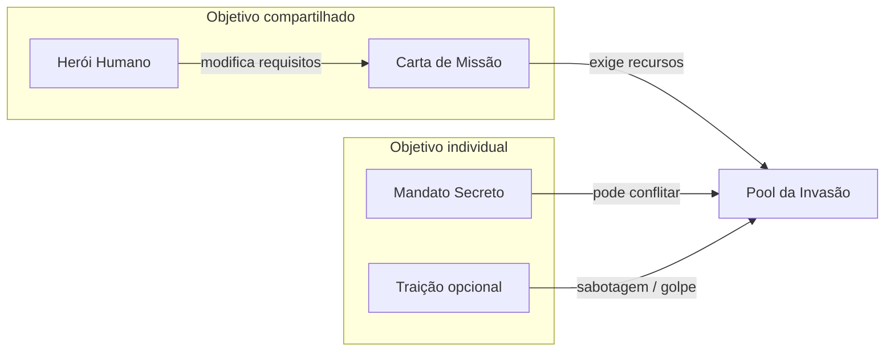
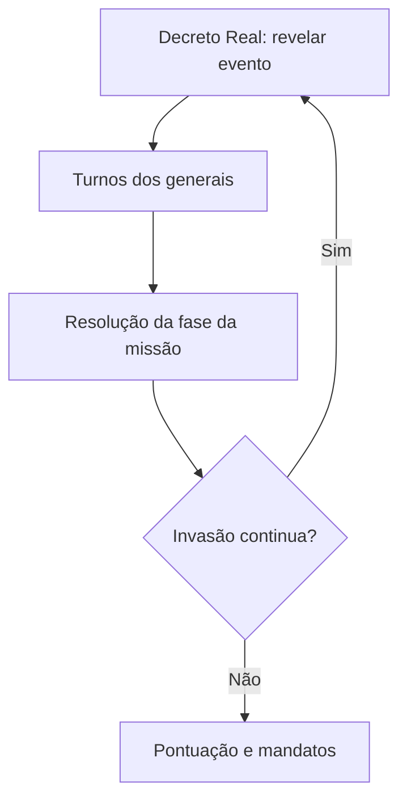

# GDD — DemonLord

> ⚠️ **Versão 0.1 arquivada.** O PO redirecionou o design.  
> **Versão atual:** [GDD-v0.2.md](GDD-v0.2.md) · [Pivot v0.1→v0.2](DESIGN-PIVOT-v0.2.md)

Documento mestre de design. Versão **0.1** — pré-produção (papel). **Não reflete a visão atual do jogo.**

---

## Índice

1. [Visão geral](#1-visão-geral)
2. [Pilares e tensões de design](#2-pilares-e-tensões-de-design)
3. [Modelo de vitória (resolver conflitos)](#3-modelo-de-vitória-resolver-conflitos)
4. [Componentes](#4-componentes)
5. [Recursos e economia](#5-recursos-e-economia)
6. [Estrutura de turno](#6-estrutura-de-turno)
7. [Cartas — tipos e funções](#7-cartas--tipos-e-funções)
8. [Missões e dificuldade](#8-missões-e-dificuldade)
9. [Heróis humanos (antagonista modular)](#9-heróis-humanos-antagonista-modular)
10. [Mandatos secretos](#10-mandatos-secretos)
11. [Traição e golpe de estado](#11-traição-e-golpe-de-estado)
12. [Fim de jogo e pontuação](#12-fim-de-jogo-e-pontuação)
13. [Replayability](#13-replayability)
14. [Referências e o que absorvemos](#14-referências-e-o-que-absorvemos)
15. [Riscos de design e mitigações](#15-riscos-de-design-e-mitigações)
16. [Conteúdo MVP — catálogo inicial](#16-conteúdo-mvp--catálogo-inicial)
17. [Playtest e próximos passos](#17-playtest-e-próximos-passos)

---

## 1. Visão geral

### Elevator pitch

Os jogadores são **generais do Rei Demônio** numa campanha de invasão ao Reino Humano. O trono tem poucos recursos; cada general recebe um **mandato secreto** do rei e deve **comprar, converter e alocar** ouro, comida e poder militar ao longo de várias expedições. A mesa precisa cumprir **cartas de missão** com requisitos crescentes — mas vencer a invasão não garante vitória individual: quem melhor cumprir o mandato secreto (ou executar um golpe) leva a glória.

### Gênero e posicionamento

| Aspecto | Definição |
|---------|-----------|
| **Tipo** | Board game de cartas, semi-cooperativo |
| **Mecânicas centrais** | Compra/alocação de recursos, mandatos ocultos, missões modulares, negociação |
| **Tom** | Dark fantasy cômico-sombrio; intriga de corte demoníaca |
| **Jogadores** | 3–5 (sweet spot: 4) |
| **Duração** | 60–90 min |
| **Idade** | 14+ |

### Fantasia do jogador

Você é um general ambicioso: leal o suficiente para não ser executado, egoísta o bastante para desviar suprimentos. O rei vê tudo… em teoria. Na prática, você negocia, acusa e justifica cada gasto.

### O que este jogo **não** é

- **Não** é puramente cooperativo (evita quarterbacking, mas exige alinhamento mínimo).
- **Não** é social deduction puro estilo *The Resistance* (ações têm consequências mecânicas visíveis, não só votação).
- **Não** é deck-building pesado; o baralho de compra é compartilhado e fixo por partida.

---

## 2. Pilares e tensões de design

| Pilar | Significado | Exemplo na mesa |
|-------|-------------|-----------------|
| **Escassez com escolha** | Recursos sempre faltam para tudo | Recrutar ogros ou pagar tributo ao rei? |
| **Lealdade performática** | Contribuir para a missão é obrigatório para sobreviver politicamente | Quem não ajuda perde influência e pode ser alvo de acusação |
| **Ambição secreta** | Vitória individual ≠ vitória da mesa | Mandato pede acumular ouro enquanto a missão exige gastá-lo |
| **Rejogabilidade modular** | Missão + herói + mandatos mudam cada partida | Herói Paladino exige mais militar; Arquimago pune excesso de ouro mágico |

### Tensão central (o coração do jogo)



---

## 3. Modelo de vitória (resolver conflitos)

A ideia original misturava **coop total**, **mandatos restritivos** e **traição**. O modelo abaixo unifica tudo sem contradição.

### Três camadas de objetivo

| Camada | Quem define | Falha | Sucesso |
|--------|-------------|-------|---------|
| **1. Invasão (mesa)** | Carta de Missão + Herói | Moral do exército chega a 0 **ou** missões falham demais | Última fase da missão é vencida |
| **2. Mandato (individual)** | Carta secreta do Rei | — | Condição privada cumprida no fim |
| **3. Golpe (opcional)** | Subtipo de mandato traidor | Revelação prematura sem apoio | Condições de golpe atendidas |

### Regra de ouro

> **A mesa pode perder todos juntos. A mesa não ganha todos juntos.**

- Se a invasão **falha** → ninguém vence (exceto mandatos raros de “sobreviver à derrota”).
- Se a invasão **vence** → apenas jogadores que cumpriram o mandato (e não foram depostos) **vencem**.
- Pode haver **múltiplos vencedores** se vários cumpriram mandatos compatíveis.
- **Um** jogador pode vencer sozinho via golpe bem-sucedido, mesmo com invasão falhando (vitória narrativa do usurpador).

### Por que não “traidor oculto obrigatório”?

Pesquisa de design ([Christian Beck — Traitor Mechanics](https://chrisbeckdesign.com/2021/07/10/design-tips-traitor-mechanics/)) recomenda:

1. O jogo base deve ser **vencível sem traidor**.
2. Traição deve ser **escolha de risco**, não identidade fixa revelada cedo.
3. Ações ruins devem ser **indistinguíveis de erros ou mandatos legítimos**.

**Solução DemonLord:** traição é um **tipo de mandato** (~20% do baralho), não uma role separada garantida. Isso evita partidas onde “o traidor não fez nada” ou “achamos o traidor e o jogo acabou”.

---

## 4. Componentes

### MVP (primeiro protótipo)

| Componente | Qtd | Notas |
|------------|-----|-------|
| Cartas de recurso (Ouro / Comida / Militar) | 60 | Valores 1, 2, 3; ícones grandes |
| Cartas de mercado (compra) | 40 | Raças, edifícios, rituais, subornos |
| Cartas de missão (fases) | 12 missões × 3 fases = 36 | Baralho modular |
| Cartas de herói | 8 | 1 ativa por partida |
| Cartas de mandato secreto | 24 | 4 categorias (ver §10) |
| Cartas de evento / decreto real | 20 | Crises e interferência do rei |
| Marcadores de influência | 25 | Por jogador |
| Marcador de moral da invasão | 1 | Trilha 0–12 |
| Marcador de fase da missão | 1 | 1 → 3 |
| Dado de acusação | 1 | d6, faces 1–3 vazias (ver §11) |
| Tabuleiro central (opcional no MVP) | 1 | Trilhas: Moral, Fase, Pool de recursos da missão |

> **MVP em cartas só:** o “tabuleiro” pode ser um cartão de referência A4; não bloquear playtest por arte.

---

## 5. Recursos e economia

### Os três recursos

| Recurso | Cor | Obtido por | Gasto típico |
|---------|-----|------------|--------------|
| **Ouro** | Amarelo | Mercado, tributos, saque (eventos) | Recrutamento de raças premium, suborno, rituais |
| **Comida** | Verde | Requisição, conversão, eventos | Manter moral, marchas longas, raças vorazes |
| **Militar** | Vermelho | Recrutamento, treino, equipamento | Cumprir requisitos de ataque, defesa contra herói |

### Pool compartilhado vs reservas pessoais

| Local | Quem vê | Uso |
|-------|---------|-----|
| **Cofre da Invasão** (mesa) | Todos | Pagar requisitos da fase atual da missão |
| **Estoque pessoal** (mão / área) | Dono + cartas viradas públicas quando exigido | Compras, mandatos, golpe |
| **Descarte do Rei** | Monte comum | Cartas compradas usadas vão aqui; alguns eventos recuperam |

**Regra:** no fim de cada turno, o jogador deve **contribuir com pelo menos 1 recurso** para o Cofre **ou** perder 1 Influência. Isso mantém a mesa avançando e gera pista de quem está segurando recursos.

### Conversão (ação limitada)

Uma vez por turno, um jogador pode converter:

| De → Para | Taxa | Custo extra |
|-----------|------|-------------|
| Ouro → Comida | 2:1 | — |
| Ouro → Militar | 2:1 | — |
| Comida → Militar | 3:1 | — |
| Militar → Ouro | 2:1 | Perde 1 Moral (saque interno) |

Conversões são **públicas** — geram narrativa e suspeita.

### Compra no mercado

- Revelar 4 cartas do baralho de mercado (fila).
- Pagar custo indicado (ícones de recurso).
- Cartas compradas vão para estoque pessoal; efeitos imediatos resolvem na hora.
- No fim da rodada, descarta-se a fila não comprada e repõe.

---

## 6. Estrutura de turno

### Setup da partida

1. Escolher **carta de missão** (nível de dificuldade acordado ou aleatório).
2. Revelar **herói humano** (modificador da missão).
3. Embaralhar **mandatos**; 1 por jogador; extras voltam à caixa **sem olhar**.
4. Moral = 6; Fase = 1; Cofre vazio.
5. Cada jogador: 3 Ouro, 2 Comida, 2 Militar (ajustável em playtest); Influência = 3.

### Macro-loop (rodada)



### Turno do general (4 ações, escolhe ordem)

| # | Ação | Detalhe |
|---|------|---------|
| 1 | **Comprar** | 1 carta do mercado |
| 2 | **Recrutar / Jogar** | Usar carta de mercado da mão |
| 3 | **Contribuir** | Mover recursos pessoais → Cofre (pode ser 0, mas ver penalidade) |
| 4 | **Intriga** | Negociar, trocar, ou iniciar **Acusação** (custa 1 Influência) |

**Limite:** máximo 2 ações do mesmo tipo por turno.

### Resolução da fase (fim da rodada)

1. Comparar Cofre vs requisitos da **fase atual** (modificados pelo herói).
2. **Sucesso:** avança fase; se fase 3, invasão vencida; +1 Moral.
3. **Falha parcial** (atingiu ≥70%): não avança; −1 Moral.
4. **Falha total** (<70%): −2 Moral; revelar penalidade da carta de missão.
5. Esvaziar Cofre para descarte.
6. Se Moral = 0 → fim de jogo (derrota da mesa, salvo golpe).

---

## 7. Cartas — tipos e funções

### 7.1 Cartas de mercado (compra)

| Subtipo | Exemplo | Efeito |
|---------|---------|--------|
| **Raça** | Ogros, Goblins, Súcubos | +Militar; algumas exigem Comida contínua |
| **Edifício** | Forja Abissal | Bônus permanente ao contribuir Militar |
| **Ritual** | Chuva de Cinzas | Converte Comida em Militar em massa (1 uso) |
| **Suborno** | Ouro sob a mesa | Rouba 2 Ouro de outro jogador (ação disputada) |
| **Logística** | Caravanas de Saque | +Ouro; −1 Moral |

### 7.2 Cartas de evento (Decreto Real)

- **Crise:** exige tipo extra de recurso nesta rodada.
- **Favor real:** quem contribuiu mais ganha Influência.
- **Auditoria:** todos mostram estoques; quem tiver mais Ouro perde 1 Influência.
- **Reforço humano:** herói ativa habilidade extra.

### 7.3 Cartas de mandato — ver §10

### 7.4 Cartas de missão — ver §8

### 7.5 Cartas de herói — ver §9

---

## 8. Missões e dificuldade

Cada **missão** é um conjunto de **3 fases** (cartas encadeadas). A mesa joga uma missão por partida no MVP.

### Níveis de dificuldade

| Nível | Nome | Total aproximado no Cofre (3 rodadas) | Eventos extras |
|-------|------|----------------------------------------|----------------|
| ★ | Incursão | 18–22 recursos | 0 |
| ★★ | Cerco | 24–30 | +1 crise na fase 2 |
| ★★★ | Assalto à Capital | 32–40 | +1 crise; herói com habilidade reforçada |

### Template de fase

```
Fase N — [Nome]
Requisito: X Ouro, Y Comida, Z Militar
Sucesso: [avanço]
Falha: [penalidade de moral ou efeito persistente]
```

### Exemplo completo — Missão ★★ “Portão de Cinzas”

| Fase | Nome | Requisito | Falha |
|------|------|-----------|-------|
| 1 | Atravessar o Pântano | 4 Comida, 2 Militar | −1 Moral |
| 2 | Romper o Muro | 6 Militar, 3 Ouro | Não avança; −1 Moral |
| 3 | Tomar a Torre | 5 Ouro, 4 Comida, 5 Militar | −2 Moral |

### Baralho de missões (MVP: 4 missões × 3 fases)

| ID | Tema | Dificuldade | Twist |
|----|------|-------------|-------|
| M01 | Portão de Cinzas | ★★ | Fase 2 pune falta de Militar |
| M02 | Vale Fértil | ★ | Fase 1 exige muita Comida |
| M03 | Cidadela do Norte | ★★★ | Todas as fases exigem Ouro alto |
| M04 | Costa dos Refugiados | ★★ | Falha em fase 1 adiciona crise na 2 |

**Rejogabilidade:** combinar missão + herói + mandatos diferentes muda prioridades sem novas regras.

---

## 9. Heróis humanos (antagonista modular)

Um herói é revelado no setup e **modifica requisitos ou regras** até o fim.

| Herói | Fantasia | Modificador |
|-------|----------|-------------|
| **Ser Aldric, o Paladino** | Tanque sagrado | +2 Militar em toda fase; comida extra não conta em fases ímpares |
| **Maga Elira** | Controle arcano | Jogador que contribuir mais Ouro numa rodada perde 1 Influência (magia detecta ganância) |
| **Capitão Riven** | Guerrilha | Cada falha parcial rouba 1 recurso aleatório do Cofre antes da contagem |
| **Bispo Kael** | Moral humana | −1 Moral da invasão no início de cada rodada |
| **Ladina Sable** | Sabotagem | Uma vez por partida, reduz um tipo de recurso no Cofre em 50% (arredonda contra) |
| **Arquimago Theron** | Antimagia | Rituais do mercado custam +1 Ouro |
| **Rainha Mira** | Diplomacia | Fases podem ser vencidas com 60% do requisito, mas sem bônus de moral |
| **Caçador de Demônios Voss** | Foco em líderes | Quem tiver mais Influência no fim da rodada deve descartar 1 carta |

**Design note:** heróis não são “inimigo com HP”; são **modificadores de puzzle** para evitar combate complexo no MVP.

---

## 10. Mandatos secretos

Distribuídos pelo Rei no setup. **Nunca** exigem revelar a carta até o fim (exceto golpe).

### Categorias

| Categoria | % do baralho | Vitória |
|-----------|--------------|---------|
| **Lealdade** | 40% | Cumprir mandato + invasão vence |
| **Restrição** | 30% | Cumprir mandato + invasão vence |
| **Ambição** | 10% | Cumprir mandato + invasão vence (conflita com mesa) |
| **Golpe** | 20% | Condição de golpe OU mandato alternativo menor |

### Exemplos — Lealdade

| Mandato | Condição |
|---------|----------|
| Favor do Trono | Terminar com ≥5 Influência |
| Mão de Ferro | Contribuir com mais Militar que qualquer outro (acumulado) |
| Logística Impecável | Terminar com ≥4 Comida pessoal |

### Exemplos — Restrição (suas ideias organizadas)

| Mandato | Condição | Restrição durante o jogo |
|---------|----------|--------------------------|
| Economia de Guerra | Terminar com 8+ Ouro pessoal | Máx. **2 Ouro por rodada** gastos em cartas de **Raça** |
| Dieta do Exército | Vencer com 6+ Comida pessoal | Não pode converter Comida → Militar |
| Recrutador Seletivo | Ter 3 raças diferentes na mão | Máx. 1 carta Raça comprada por rodada |
| Tributo Silencioso | Ter contribuído menos que a média | Deve vencer a invasão |

> **Importante:** restrições são **privadas**. Violar gera suspeita apenas se alguém observar (ex.: comprar 3 raças numa rodada). Isso permite blefe e erro aparente.

### Exemplos — Ambição

| Mandato | Condição |
|---------|----------|
| Tesouro do General | 10+ Ouro pessoal no fim |
| Senhor das Legiões | 8+ Militar pessoal no fim |
| Duplo Agente | Ter carta Suborno usada + invasão vencida |

### Exemplos — Golpe (traição estruturada)

| Mandato | Vitória principal | Vitória alternativa (se invasão falhar) |
|---------|-------------------|----------------------------------------|
| Usurpador | Golpe bem-sucedido | — |
| Oportunista | 12+ Ouro + golpe **não** tentado | 6+ Ouro se mesa perder |
| Infiltrado Humano | Invasão falhe **e** você tenha ≥4 Influência | — |

---

## 11. Traição e golpe de estado

### Filosofia (baseada em pesquisa)

| Princípio | Aplicação em DemonLord |
|-----------|------------------------|
| Esconder ações, não só identidade | Suborno e conversão Militar→Ouro são públicos; “por quê” é ambíguo |
| Traidor não deve parar de jogar após suspeita | Golpe falho → penalidade, não eliminação |
| Jogo vencível sem traidor | 80% dos mandatos não são golpe |
| Escolhas justificáveis | “Não contribuí porque meu mandato limita ouro em raças” |

### Mecânica de Acusação

- Custa 1 Influência.
- Alvo rola dado de acusação + modificador (+1 se alvo tem menos Influência que acusador).
- **3+:** alvo revela **metade** dos recursos (arredonda para cima) OU descarta 1 carta de mercado.
- **Não elimina** o jogador; gera informação parcial.

### Golpe de estado (mandato Golpe)

**Pré-requisitos cumulativos** (visíveis apenas para o jogador até tentar):

1. 6+ Ouro pessoal **e** 3+ Influência.
2. Pelo menos **2 outros jogadores** com ≤2 Influência (apoio fraco da corte).
3. Fase da missão = 2 ou 3.

**Tentativa (ação Intriga):**

- Anuncia golpe publicamente.
- Cada outro jogador vota Apoio / Neutral / Contra (simultâneo).
- **Apoio > Contra:** usurpador vence **sozinho** imediatamente; invasão irrelevante.
- **Contra ≥ Apoio:** −3 Influência do usurpador; −2 Moral; revela mandato; continua jogo.

### Roubo de recursos (sem golpe)

Cartas **Suborno** e eventos permitem tirar Ouro de jogador. Isso serve mandatos de Ambição **e** Golpe, sem precisar de role “traidor”.

---

## 12. Fim de jogo e pontuação

### Condições de fim

| Trigger | Resultado |
|---------|-----------|
| Fase 3 vencida | Invasão bem-sucedida → checagem de mandatos |
| Moral = 0 | Derrota da mesa → apenas mandatos que premiam falha |
| Golpe bem-sucedido | Fim imediato; usurpador único vencedor |

### Ordem de resolução

1. Verificar golpe (se ocorreu nesta rodada).
2. Verificar mandatos de “invasão falhou”.
3. Se invasão venceu: cada jogador revela mandato; valida restrições **retroativamente** (honestidade; trapaça = perde).
4. Múltiplos vencedores permitidos.

### Desempate

Mais Influência → mais Ouro pessoal → contribuição total ao Cofre na última fase.

---

## 13. Replayability

| Vetor | Variações MVP |
|-------|---------------|
| Missão | 4 × 3 fases = 12 cartas |
| Herói | 8 |
| Mandato | 24 |
| Eventos | 20 |
| Mercado | 40 cartas (ordem de revelação) |

**Combinações teóricas (ordem de grandeza):** 4 × 8 × C(24,4) × baralho eventos ≈ **milhares** de setups distintos antes de repetir sensação.

### Escalabilidade pós-MVP

- Campanha ligada (missões em sequência).
- Generais com poder passivo único.
- Expansão “Reino em Guerra” com múltiplos heróis ativos.

---

## 14. Referências e o que absorvemos

| Jogo | O que absorvemos | O que NÃO copiamos |
|------|------------------|-------------------|
| **Dead of Winter** | Objetivo de colônia + mandato secreto; crise por rodada | Zombies, movimento no mapa, dado de sobrevivente |
| **Nemesis** | Cooperação tentativa; vitória individual explícita | Miniaturas, combate tático, tempo real |
| **The Resistance** | Tensão social | Votação pura sem economia |
| **Battlestar Galactica** | Traição com consequência pós-revelação | Traidor único obrigatório; jogo longo |
| **7 Wonders / Splendor** | Conversão e compra de recursos | Draft e engine sem narrativa |
| **Secret Hitler** | Calibrar informação vs ruído | Política pura sem recursos físicos |

### Lições de design externas

1. **Jogue sem traidor primeiro** — validar se a mesa consegue vencer missões ★★ com mandatos Lealdade apenas ([BK Game Design](https://bkgamedesign.medium.com/social-deduction-game-design-fundamentals-a4cbae378005)).
2. **Ações situacionais** — comprar carta de saque ajuda a mesa (ouro) e prejudica (moral); justificativa importa ([Balangay](https://www.balangay.games/designing-a-social-deduction-tabletop-game/)).
3. **Evitar kingmaker** — mandatos Ambição devem ser alcançáveis sem torpedear a última fase de propósito.
4. **Quarterbacking** — informação parcial (estoques pessoais ocultos até auditoria) e objetivos privados reduzem um jogador mandar em todos ([Justin Gary](https://justingarydesign.substack.com/p/the-quarterback-problem)).

---

## 15. Riscos de design e mitigações

| Risco | Por que acontece | Mitigação |
|-------|------------------|-----------|
| **Conflito coop vs traição** | Mesa precisa alinhar, mas mandatos puxam para lado | Modelo semi-coop: falha coletiva, vitória individual |
| **Mandatos impossíveis com certo herói** | Ex.: limitar ouro em raças + missão que exige só militar | Ícones de compatibilidade no verso do mandato; deal 2 mandatos e descarta 1 no setup |
| **Traidor óbvio** | Quem não contribui é sempre culpado | Contribuição mínima obrigatória; restrições explicam baixa contribuição |
| **Traidor invisível** | Golpe nunca compensa o risco | Vitória solo do golpe deve ser **épica**, não só +1 ponto |
| **Kingmaker** | Jogador perdido ajuda outro ou destrói mesa | Mandatos alternativos em derrota; Influência como “vida política” |
| **Análise paralisia** | Muitos recursos e conversões | 3 recursos apenas; ícones grandes; folha de ajuda |
| **Partida muito longa** | 5 jogadores × 4 ações × muitas rodadas | 3 fases fixas; teto 90 min; missão ★ para primeira sessão |
| **Blefe sem agência** | Eventos aleatórios demais | Eventos modificam puzzle, não anulam contribuição |
| **Sensação injusta** | Mandato Ambição mais fácil | Balancear por categoria; playtest estatístico |
| **Conflito temático** | Demônios cooperando | Enquadrar como “corte” — cooperação é exigência do rei, não amizade |

### Sinais de alerta no playtest

- [ ] Mesa perde 80%+ das partidas ★ sem mandatos difíceis → requisitos altos demais.
- [ ] Ninguém tenta golpe em 10 partidas → pré-requisitos fáceis demais ou recompensa fraca.
- [ ] Acusação usada todo turno → custo baixo ou payoff alto demais.
- [ ] Um recurso ignorado → rebalancear missões/heróis.

---

## 16. Conteúdo MVP — catálogo inicial

### Mercado (amostra 12/40)

| ID | Nome | Custo | Efeito |
|----|------|-------|--------|
| K01 | Goblins | 2 Ouro | +2 Militar |
| K02 | Ogros | 3 Ouro, 1 Comida | +4 Militar |
| K03 | Súcubos | 2 Ouro, 1 Militar | Rouba 1 Influência de alvo |
| K04 | Caravanas | 1 Militar | +3 Ouro; −1 Moral |
| K05 | Forja Abissal | 4 Ouro | +1 Militar permanente ao contribuir |
| K06 | Banquete dos Clãs | 2 Ouro | +3 Comida |
| K07 | Ritual de Sangue | 2 Comida | +3 Militar (descarta após) |
| K08 | Suborno | 3 Ouro | Rouba 2 Ouro de jogador |
| K09 | Tributo ao Rei | — | +2 Influência; descarta 2 Ouro |
| K10 | Escória | 1 Ouro | +1 Militar |
| K11 | Celeiro Maldito | 3 Comida | +2 Comida por rodada (2 rodadas) |
| K12 | Deserção forçada | 1 Influência | Outro jogador perde 2 Militar |

### Eventos (amostra 8/20)

| ID | Nome | Efeito |
|----|------|--------|
| E01 | Fome no acampamento | +2 Comida exigida nesta rodada |
| E02 | Auditoria real | Maior estoque de Ouro perde 1 Influência |
| E03 | Bênção do Rei | +1 Moral |
| E04 | Emboscada humana | −1 Moral; +2 Militar exigido |
| E05 | Mercadores demônios | Repõe mercado completo |
| E06 | Revolta interna | Quem tiver menos Influência perde 1 recurso |
| E07 | Profecia | Próxima fase: −1 de qualquer requisito |
| E08 | Duplicidade | Jogador com mais cartas na mão descarta 1 |

### Mandatos (lista completa MVP — 24)

**Lealdade (10):** Favor do Trono, Mão de Ferro, Logística Impecável, Veterano, Estratega, Sem Desperdício, Protetor do Rei, Marcha Forçada, Disciplina, Último Baluarte.

**Restrição (7):** Economia de Guerra, Dieta do Exército, Recrutador Seletivo, Tributo Silencioso, Pacifista Relutante (máx. 4 Militar pessoal), Mão Limpa (não usar Suborno), Frugal (máx. 3 compras por partida).

**Ambição (3):** Tesouro do General, Senhor das Legiões, Duplo Agente.

**Golpe (4):** Usurpador, Oportunista, Infiltrado Humano, Herdeiro do Trono (golpe com 1 apoio a menos).

---

## 17. Playtest e próximos passos

### Fase 0 — Papel (agora)

- [ ] Imprimir cartas índice 3×5 com texto deste GDD.
- [ ] 5 playtests solo simulando 4 jogadores (controle mental de mandatos).
- [ ] Ajustar requisitos de missão ★ e ★★ até taxa de vitória ~50%.

### Fase 1 — Protótipo mínimo

- [ ] Cartas em nanquim / Print & Play.
- [ ] Registrar: duração, vitórias, golpes tentados, mandatos cumpridos.
- [ ] Testar sem mandatos Golpe (só Lealdade + Restrição).

### Fase 2 — Balanceamento social

- [ ] Introduzir mandatos Golpe.
- [ ] Variar 3–5 jogadores.
- [ ] Encurtar se >90 min.

### Entregáveis futuros (fora deste GDD)

- `docs/RULEBOOK.md` — regras para jogador (linguagem imperativa).
- `docs/PLAYTEST.md` — planilha de sessões.
- `print/` — arquivos PnP.

---

## Apêndice A — Resumo de uma rodada (folha de mesa)

```
1. DECRETO REAL → evento
2. TURNOS (ordem do rei / influência)
   Cada general: até 4 ações (Comprar, Recrutar, Contribuir, Intriga)
   Fim do turno: contribuir ≥1 ao Cofre ou −1 Influência
3. RESOLUÇÃO
   Cofre vs requisito da fase (+ herói)
   Sucesso / falha parcial / falha total
   Esvaziar Cofre
4. Se Moral 0 ou Fase 3 ok ou Golpe → FIM
```

---

## Apêndice B — Glossário

| Termo | Definição |
|-------|-----------|
| **Cofre da Invasão** | Pool compartilhado de recursos para cumprir a fase |
| **Mandato** | Objetivo secreto individual |
| **Moral** | Saúde da campanha; 0 = derrota |
| **Influência** | Moeda política; acusações, golpes, favores |
| **Fase** | Etapa 1–3 da carta de missão ativa |
| **Golpe** | Tentativa de vitória solo do usurpador |

---

*Documento vivo. Versão 0.1 — alinhado ao conceito inicial do autor, com conflitos de design resolvidos em modelo semi-cooperativo.*
